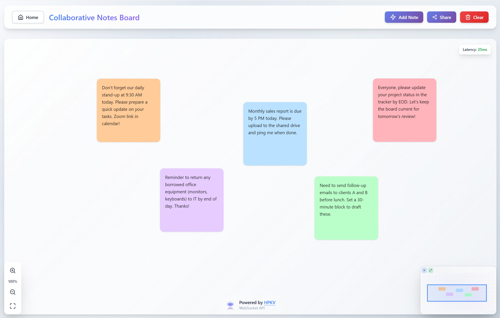

# Collaborative Notes Board

A real-time collaborative sticky notes application built with [multiplayer middleware](https://www.npmjs.com/package/@hpkv/zustand-multiplayer) for [Zustand](https://zustand.docs.pmnd.rs/). Multiple users can create, edit, and move notes simultaneously with live cursor tracking.

**🎯 [Live Demo](https://notesboard.hpkv.io/)**



## Features

- 🤝 **Real-time collaboration** - Multiple users editing simultaneously
- 👀 **Live cursors** - See where other users are working
- 📝 **Drag & drop notes** - Instant sync across all clients
- 🎨 **Color customization** - Real-time visual updates
- 📱 **Mobile responsive** - Touch-friendly interface
- 🔐 **Bot protection** - Cloudflare Turnstile integration
- 🎯 **Smart positioning** - Automatic note placement
- 📊 **Viewport controls** - Zoom and pan functionality

## Tech Stack

- **[Next.js 15](https://nextjs.org/)** - React framework
- **[Zustand](https://zustand.docs.pmnd.rs/)** - State management
- **[@hpkv/zustand-multiplayer](https://www.npmjs.com/package/@hpkv/zustand-multiplayer)** - Real-time multiplayer middleware
- **[Tailwind CSS](https://tailwindcss.com/)** - Styling
- **[TypeScript](https://www.typescriptlang.org/)** - Type safety
- **[Cloudflare Pages](https://pages.cloudflare.com/)** - Deployment

## How It Works

### 1. Zustand Store with Multiplayer Middleware

```typescript
// src/lib/store.ts
import { create } from 'zustand';
import { multiplayer, WithMultiplayer } from '@hpkv/zustand-multiplayer';

export const createNotesStore = (boardId: string, tokenGenerationUrl: string) => {
  return create<WithMultiplayer<NotesBoardState>>()(
    multiplayer(
      (set) => ({
        notes: {},
        liveUsers: {},
        viewport: { panOffset: { x: 0, y: 0 }, zoomLevel: 1 },

        addNote: (partialNote) => {
          set(state => {
            const id = uuidv4();
            state.notes[id] = {
              id,
              position: partialNote.position || { x: 50, y: 50 },
              dimensions: partialNote.dimensions || { width: 200, height: 200 },
              text: partialNote.text || '',
              color: partialNote.color || '#ffffa0',
              zIndex: state.clientZCounter++
            };
          });
        },

        // ... other actions
      }),
      {
        namespace: `notes-board-${boardId}`,
        tokenGenerationUrl,
        apiBaseUrl: process.env.NEXT_PUBLIC_HPKV_API_BASE_URL!,
        subscribeToUpdatesFor: () => ['notes', 'liveUsers'],
        publishUpdatesFor: () => ['notes', 'liveUsers']
      }
    )
  );
};
```

### 2. Token Generation API

```typescript
// src/pages/api/generate-token.ts
import { TokenHelper } from '@hpkv/zustand-multiplayer';

export default async function handler(req, res) {
  const { HPKV_API_KEY, HPKV_API_BASE_URL } = await getEnvironmentConfig();
  
  const tokenHelper = new TokenHelper(HPKV_API_KEY, HPKV_API_BASE_URL);
  const token = await tokenHelper.processTokenRequest(req.body);
  
  res.status(200).json(token);
}
```

### 3. React Context for Store Access

```typescript
// src/contexts/BoardContext.tsx
import { createContext, useContext } from 'react';
import { useStoreManager } from '@/hooks/useStoreManager';

export const BoardProvider = ({ children, boardId }) => {
  const { store, isLoading, error, retry } = useStoreManager(boardId);
  
  if (isLoading) return <LoadingSpinner />;
  if (error) return <ErrorComponent onRetry={retry} />;
  
  return (
    <BoardContext.Provider value={{ store, boardId }}>
      {children}
    </BoardContext.Provider>
  );
};

// Custom hooks for easy store access
export const useNotes = () => {
  const { store } = useBoardContext();
  return store((state) => state.notes);
};

export const useBoardActions = () => {
  const { store } = useBoardContext();
  return {
    addNote: store.getState().addNote,
    selectNote: store.getState().selectNote,
    clearBoard: store.getState().clearBoard,
  };
};
```

### 4. Component Usage

```typescript
// src/components/Board/NotesBoard.tsx
import { useNotes, useBoardActions } from '@/contexts/BoardContext';

function NotesBoard() {
  const notes = useNotes(); // Real-time synced notes
  const { addNote, updateNotePosition } = useBoardActions();

      return noteIds.map((noteId) => (
      <NoteItem
        key={noteId}
        noteId={noteId}
        onSelect={stableSelectNote}
        boardBounds={stableBoardBounds}
      />
    ));
}
```

## Local Setup

### Prerequisites
- **Node.js 18+** and npm
- **HPKV API account** - [Get one free at hpkv.io](https://hpkv.io)

### Installation

1. **Clone and install:**
```bash
git clone https://github.com/hpkv-io/showcase-multiplayer-notesboard.git
cd showcase-multiplayer-notesboard
npm install
```

2. **Environment setup:**

Create `.env.local`:
```env
HPKV_API_BASE_URL=your-hpkv-api-base-url
NEXT_PUBLIC_HPKV_API_BASE_URL=your-hpkv-api-base-url
HPKV_API_KEY=your-hpkv-api-key
NEXT_PUBLIC_BASE_URL=http://localhost:3000
# Performance and Throttling parameters. Adjust for best results
NEXT_PUBLIC_HPKV_RPS_LIMIT=50  # Set this based on your HPKV subscription rate limit
NEXT_PUBLIC_THROTTLE_DEFAULT_DELAY_MS=30
NEXT_PUBLIC_TARGET_LATENCY_MS=50
NEXT_PUBLIC_BASE_RATE = 29
NEXT_PUBLIC_MIN_RATE =  2
```

3. **Run development server:**
```bash
npm run dev
```

Open [http://localhost:3000](http://localhost:3000) and test collaboration with multiple tabs!

## Deploy to Cloudflare

1. **Connect your GitHub repo** to [Cloudflare Pages](https://pages.cloudflare.com)

2. **Set environment variables:**
```env
HPKV_API_KEY=your-hpkv-api-key
HPKV_API_BASE_URL=your-hpkv-api-base-url
NEXT_PUBLIC_HPKV_API_BASE_URL=your-hpkv-api-base-url
NEXT_PUBLIC_BASE_URL=https://your-app.pages.dev
NEXT_PUBLIC_HPKV_RPS_LIMIT=50  # Set this based on your HPKV subscription rate limit
NEXT_PUBLIC_THROTTLE_DEFAULT_DELAY_MS=30
NEXT_PUBLIC_TARGET_LATENCY_MS=50
NEXT_PUBLIC_BASE_RATE = 29
NEXT_PUBLIC_MIN_RATE =  2
NEXT_PUBLIC_TURNSTILE_SITE_KEY=your-turnstile-site-key
TURNSTILE_SECRET_KEY=your-turnstile-secret-key
```

3. **Deploy!** Cloudflare will automatically build and deploy your app.

> 💡 **Get your keys:**
> - **HPKV API key** from [hpkv.io](https://hpkv.io)
> - **Turnstile keys** from [Cloudflare Turnstile](https://developers.cloudflare.com/turnstile/get-started/)

## Learn More

- **[HPKV Multiplayer Docs](https://www.npmjs.com/package/@hpkv/zustand-multiplayer)** - Full middleware documentation
- **[Zustand Docs](https://zustand.docs.pmnd.rs/)** - State management guide
- **[HPKV Dashboard](https://hpkv.io)** - Get your API key


